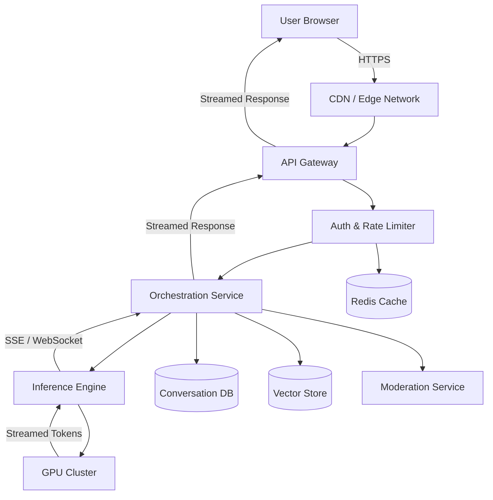
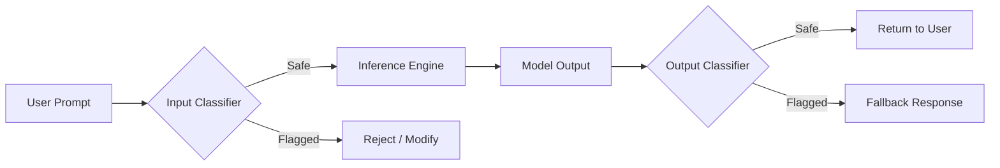

Every time you type a message into ChatGPT and watch tokens stream back in real time, you're interacting with one of the most complex distributed systems ever built. Behind that deceptively simple chat interface lies a multi-layered architecture spanning frontend edge networks, API gateways, orchestration services, and massive GPU clusters running trillion-parameter models.

This post breaks down the **complete system design** of a ChatGPT-like service — from the React frontend to the CUDA kernels on an H100 GPU. Whether you're preparing for a system design interview or building your own LLM-powered product, this guide gives you a production-grade mental model of every layer in the stack.

---

## 🏗️ High-Level Architecture Overview

Before diving into each layer, let's visualize the full request lifecycle. When a user sends a message, it travels through roughly seven distinct layers before a response streams back.



**Request flow in plain English:**

1. The user types a prompt in the browser.
2. The request hits the CDN edge, then routes to the nearest API gateway.
3. The gateway authenticates the user, checks rate limits, and forwards the request.
4. The orchestration service builds the full prompt (system message + conversation history + user input), runs moderation checks, and dispatches to inference.
5. The inference engine tokenizes the prompt, runs it through the model on a GPU cluster, and streams tokens back.
6. Each generated token flows back through the stack to the frontend, which renders it in real time.

---

## 🖥️ Frontend Layer

The frontend is not just a chat box — it's a high-performance streaming client optimized for perceived latency.

### Architecture

A **Next.js** application deployed to an edge network (e.g., Vercel Edge, Cloudflare Workers) handles:

- **Server-Side Rendering (SSR)** for the landing page and SEO-critical routes.
- **Client-Side Rendering** for the interactive chat interface.
- **Edge rendering** to minimize Time to First Byte (TTFB) for global users.

### Streaming Responses

The most critical UX decision is **token streaming**. Instead of waiting for the full response, the frontend consumes a stream and renders each token as it arrives:

```typescript
const response = await fetch("/api/chat", {
  method: "POST",
  headers: { "Content-Type": "application/json" },
  body: JSON.stringify({ messages }),
});

const reader = response.body?.getReader();
const decoder = new TextDecoder();

while (true) {
  const { done, value } = await reader!.read();
  if (done) break;
  const chunk = decoder.decode(value);
  appendToUI(chunk);
}
```

### Performance Strategies

| Strategy | Purpose |
| :--- | :--- |
| **Optimistic UI** | Show user message instantly before server confirms |
| **React Query / SWR** | Cache conversation lists, user profile, usage stats |
| **Virtualized lists** | Render only visible messages for long conversations |
| **WebSocket fallback** | Upgrade to WebSocket for persistent, bidirectional streaming |
| **Skeleton screens** | Show placeholder layouts while data loads |

Accessibility is also a first-class concern — screen readers must announce streamed tokens, and keyboard navigation must flow naturally through the chat history.

---

## 🚪 API Gateway Layer

The API gateway is the single entry point for all client requests. At scale, this layer handles **millions of requests per minute**.

### Core Responsibilities

- **Rate limiting**: Token-bucket or sliding-window algorithms enforce per-user and per-tier limits. A free user might get 10 requests per minute; a Pro user gets 60.
- **Request validation**: Schema validation ensures payloads are well-formed before they reach backend services.
- **API versioning**: Routes like `/v1/chat/completions` allow backward-compatible evolution.
- **Load balancing**: Weighted round-robin or least-connections distributes traffic across orchestration instances.
- **Observability**: Every request is tagged with a trace ID (W3C Trace Context) for end-to-end distributed tracing.

Popular implementations include **Kong**, **Envoy Proxy**, or cloud-native solutions like AWS API Gateway.

---

## 🔐 Authentication & Authorization

Security at this scale requires multiple layers of identity verification.

### JWT-Based Authentication

```typescript
// Middleware: Verify JWT on every request
import jwt from "jsonwebtoken";

function verifyToken(req: Request): DecodedUser {
  const token = req.headers.get("Authorization")?.replace("Bearer ", "");
  if (!token) throw new Error("Missing token");
  return jwt.verify(token, process.env.JWT_SECRET!) as DecodedUser;
}
```

### Multi-Layer Strategy

- **OAuth 2.0 / OIDC**: Social login via Google, GitHub, Microsoft.
- **API keys**: Enterprise customers authenticate via long-lived API keys with scoped permissions.
- **RBAC (Role-Based Access Control)**: Roles like `free`, `pro`, `enterprise`, and `admin` unlock different models, rate limits, and features.
- **Session management**: Short-lived access tokens (15 min) with long-lived refresh tokens (7 days) stored in HTTP-only cookies.
- **Abuse prevention**: Automated detection of prompt injection attempts, credential stuffing, and bot traffic using behavioral analysis and CAPTCHAs.

---

## 🧠 AI Orchestration Layer

This is the "brain" of the system — the service that sits between the API layer and the raw inference engine.

### What It Does

1. **Prompt assembly**: Combines the system prompt, conversation history, and the latest user message into a single payload that fits within the model's context window.
2. **Context window management**: For models with a 128K token limit, the orchestrator truncates or summarizes older messages to stay within budget.
3. **Conversation memory**: Retrieves past messages from the database (or a vector store for semantic search over long histories).
4. **Tool calling**: When the model outputs a tool-call instruction (e.g., "search the web", "run code"), the orchestrator executes the tool and feeds results back as a new turn.
5. **Guardrails & moderation**: Before and after inference, content passes through classifiers that detect harmful, biased, or policy-violating output.

### Moderation Pipeline



The moderation classifiers themselves are lightweight models (often distilled BERT variants) that run with sub-millisecond latency.

---

## ⚙️ Inference Engine

This is where the magic happens — transforming a sequence of tokens into a coherent, contextual response.

### Tokenization Pipeline

Before the model sees any text, the input is broken into **tokens** using a Byte-Pair Encoding (BPE) tokenizer like `tiktoken`. The string `"Hello, world!"` becomes something like `[15496, 11, 995, 0]`.

### Model Serving Stack

| Component | Technology |
| :--- | :--- |
| **Framework** | PyTorch (training), ONNX Runtime / TensorRT (optimized inference) |
| **Serving layer** | vLLM, NVIDIA Triton Inference Server, TGI (Text Generation Inference) |
| **Quantization** | INT8 / INT4 via GPTQ, AWQ, or bitsandbytes — reduces memory 2–4× with minimal quality loss |
| **Batching** | Continuous batching groups multiple requests into a single GPU pass for higher throughput |

### Streaming Token Generation

The model generates tokens **autoregressively** — one at a time. Each token is immediately flushed to the client via Server-Sent Events (SSE):

```python
from fastapi import FastAPI
from fastapi.responses import StreamingResponse

app = FastAPI()

async def generate_stream(prompt: str):
    """Yields tokens as they are generated by the model."""
    tokens = model.generate(prompt, stream=True)
    for token in tokens:
        yield f"data: {token}\n\n"

@app.post("/v1/chat/completions")
async def chat(request: ChatRequest):
    return StreamingResponse(
        generate_stream(request.prompt),
        media_type="text/event-stream"
    )
```

---

## 🦀 High-Performance Runtime

At the inference layer, every microsecond counts. Production systems use **Rust** and **C++** for the hot path.

- **Rust-based inference servers** (like Candle or custom runtimes) eliminate garbage collection pauses and provide deterministic latency.
- **Zero-copy pipelines** pass tensor data between stages without serialization overhead.
- **gRPC communication** between the orchestration service and inference nodes minimizes network serialization costs compared to REST/JSON.
- **Memory-mapped model weights** allow multiple worker processes to share the same weights in GPU memory without duplication.

---

## 🎮 GPU Infrastructure

Large language models are computationally bound by GPU memory and FLOPS. A 70B-parameter model at FP16 requires ~140 GB of VRAM — far more than a single GPU can hold.

### Parallelism Strategies

| Strategy | How It Works |
| :--- | :--- |
| **Tensor Parallelism** | Splits individual weight matrices across GPUs. A single layer runs across 4–8 GPUs simultaneously. |
| **Pipeline Parallelism** | Assigns different layers to different GPUs. Data flows through the pipeline sequentially. |
| **Data Parallelism** | Replicates the full model across GPUs and splits batches. Used mainly in training. |

### Cluster Architecture

A typical production setup runs **NVIDIA H100 or A100 GPU nodes**, each with 8 GPUs connected via **NVLink** (900 GB/s interconnect). Nodes communicate over **InfiniBand** for cross-node tensor parallelism.

### Autoscaling Strategies

- **Predictive scaling**: Based on historical traffic patterns (e.g., scale up before business hours in US timezones).
- **Reactive scaling**: Kubernetes Horizontal Pod Autoscaler (HPA) watches GPU utilization and inference queue depth.
- **Spot instances**: Non-critical batch workloads run on spot/preemptible instances at 60–70% discount.
- **Reserved capacity**: Production inference runs on reserved instances for guaranteed availability.

---

## ☁️ Cloud Infrastructure

### Multi-Region Deployment

```yaml
# Kubernetes Deployment — Inference Service
apiVersion: apps/v1
kind: Deployment
metadata:
  name: inference-service
  namespace: ai-production
spec:
  replicas: 8
  selector:
    matchLabels:
      app: inference-service
  template:
    metadata:
      labels:
        app: inference-service
    spec:
      containers:
        - name: inference
          image: registry.internal/inference-server:v2.4.1
          resources:
            limits:
              nvidia.com/gpu: 4
              memory: "320Gi"
            requests:
              nvidia.com/gpu: 4
              memory: "256Gi"
          ports:
            - containerPort: 8080
          env:
            - name: MODEL_PATH
              value: "/models/llm-70b-q8"
            - name: TENSOR_PARALLEL_SIZE
              value: "4"
      nodeSelector:
        gpu-type: h100
      tolerations:
        - key: "nvidia.com/gpu"
          operator: "Exists"
          effect: "NoSchedule"
```

### Infrastructure Stack

- **Container orchestration**: Kubernetes with GPU-aware scheduling (NVIDIA device plugin).
- **Service mesh**: Istio or Linkerd for mTLS, traffic splitting, and canary deployments.
- **CDN**: Cloudflare or CloudFront for static assets and edge caching of non-dynamic responses.
- **Object storage**: S3 or GCS for model weights, training checkpoints, and conversation exports.
- **Caching**: Redis for session data, rate limit counters, and frequently requested responses.

---

## 💾 Data Layer

### Storage Architecture

| Data Type | Storage | Reason |
| :--- | :--- | :--- |
| **Conversations** | PostgreSQL / DynamoDB | Relational queries, user ownership, pagination |
| **Embeddings** | Pinecone / pgvector / Weaviate | Similarity search for RAG and memory retrieval |
| **Model weights** | S3 / GCS | Large binary blobs, versioned |
| **Logs & telemetry** | ClickHouse / BigQuery | High-cardinality analytics, aggregation |
| **Real-time metrics** | Prometheus + Grafana | Operational dashboards |

### Logging Pipeline

Every request generates structured logs that flow through **Kafka → Flink → ClickHouse**, enabling real-time anomaly detection and post-hoc analysis of model behavior.

---

## 📊 Observability & Reliability

At this scale, you can't debug with `console.log`. You need:

- **Metrics**: Prometheus counters for tokens/sec, latency percentiles (p50, p95, p99), GPU utilization, and queue depth.
- **Distributed tracing**: OpenTelemetry traces span from the browser through the gateway, orchestrator, and inference engine — showing exactly where time is spent.
- **Alerting**: PagerDuty-integrated alerts fire if p99 latency exceeds 5s or if GPU error rates spike above 0.1%.
- **Chaos testing**: Regularly kill inference nodes, simulate network partitions, and inject latency to validate failover paths.
- **Failover**: Multi-region active-active deployments with automatic DNS failover (Route 53 health checks) target 99.99% uptime.

---

## 💰 Cost Optimization Strategies

GPU inference is the dominant cost center. A single H100 costs ~$3/hour. At scale, costs can reach **millions per month**. Key strategies:

1. **Model routing**: Route simple queries (e.g., "What's 2+2?") to smaller, cheaper models (GPT-4o mini) and complex queries to the full model.
2. **Response caching**: Cache identical or semantically similar prompts using embedding-based cache keys in Redis.
3. **Token limits**: Enforce per-request and per-conversation token budgets to prevent runaway costs.
4. **Dynamic scaling**: Scale GPU nodes down to zero during low-traffic periods (2–6 AM local time).
5. **Quantized models**: INT4 quantization reduces GPU memory by 4× — allowing a 70B model to run on a single 80GB GPU.

---

## 🔒 Security Considerations

- **Prompt injection prevention**: Input classifiers detect attempts to override the system prompt. Defense-in-depth combines input filtering, output validation, and sandboxed tool execution.
- **Data isolation**: Multi-tenant architecture ensures User A can never access User B's conversations. Row-level security in PostgreSQL and namespace isolation in Kubernetes.
- **Encryption**: TLS 1.3 in transit, AES-256 at rest. Model weights are encrypted in object storage with customer-managed keys (CMK) for enterprise tiers.
- **Secure model serving**: Inference containers run in read-only filesystems with no egress network access. Model weights are loaded from encrypted, pre-signed URLs.

---

## 🧗 Scaling Challenges

Even with all the above, these systems hit real physical bottlenecks:

- **Cold starts**: Loading a 70B model into GPU memory takes 30–90 seconds. Pre-warming strategies keep models loaded on standby nodes.
- **GPU memory limits**: A 405B model at FP16 requires ~810 GB VRAM. Even with 8× H100s (640 GB), you need quantization or pipeline parallelism across multiple nodes.
- **Latency vs. throughput**: Continuous batching improves throughput but adds latency for individual requests. Tuning the batch wait timeout is an art.
- **Network overhead**: Cross-node tensor parallelism requires InfiniBand — standard Ethernet adds unacceptable latency for synchronous all-reduce operations.

---

## 🔮 Future Improvements

The architecture is evolving fast:

- **Edge inference**: Smaller models (1–7B parameters) running directly on-device via frameworks like `llama.cpp` or Apple MLX — zero network latency.
- **Specialized models**: Instead of one massive model, route to domain-specific fine-tuned models (code, medical, legal) for better quality and lower cost.
- **Custom silicon**: Google TPUs, AWS Trainium & Inferentia, and custom ASICs offer 2–5× better cost-performance than general-purpose GPUs for transformer inference.
- **Speculative decoding**: Use a small "draft" model to predict multiple tokens, then verify with the large model in a single forward pass — 2–3× speedup.

---

## 🏁 Conclusion

Building a ChatGPT-like system is a multi-disciplinary engineering challenge that spans frontend streaming, distributed systems, GPU programming, and security. The key architectural insight is that **every layer is designed around streaming** — from the browser consuming SSE chunks to the GPU generating tokens autoregressively.

The most impactful optimizations aren't at the model layer — they're in **smart routing** (send simple queries to cheap models), **aggressive caching** (don't re-infer what you've already answered), and **right-sized infrastructure** (quantize models, use spot instances, scale to zero).

If you're building your own LLM-powered application, you don't need to replicate this entire stack. Start with a managed inference API, add streaming, and layer in complexity only when scale demands it.

---

## ❓ Frequently Asked Questions

### How does ChatGPT scale to millions of users?

Through a combination of horizontal scaling (thousands of GPU nodes behind a load balancer), continuous batching (grouping multiple requests into single GPU operations), multi-region deployments, and intelligent caching of common responses.

### Why are GPUs required for LLM inference?

Transformer models perform massive matrix multiplications during the attention mechanism. GPUs have thousands of cores optimized for parallel math operations, making them 10–100× faster than CPUs for this workload.

### How does token streaming work?

The model generates one token at a time in an autoregressive loop. Each token is immediately sent to the client via Server-Sent Events (SSE) rather than waiting for the complete response. This creates the "typing" effect users see in ChatGPT.

### What runtime is used for inference?

Production systems typically use optimized runtimes like NVIDIA TensorRT, vLLM, or NVIDIA Triton Inference Server rather than raw PyTorch. These runtimes apply kernel fusion, quantization, and continuous batching for 3–10× better performance.

### How is conversation history managed?

Conversations are stored in a database (PostgreSQL or DynamoDB). On each request, the orchestration service retrieves the conversation, truncates it to fit the model's context window, and prepends the system prompt. For very long conversations, older messages may be summarized.

### What prevents prompt injection attacks?

Multiple layers: input classifiers detect known injection patterns, the system prompt is protected via prompt isolation techniques, tool calls are sandboxed, and output classifiers filter responses before they reach the user.

### How much does it cost to run ChatGPT-scale inference?

Estimates suggest OpenAI spends $700K+ per day on inference compute alone. A single H100 GPU costs ~$3/hour, and serving a 175B+ model requires clusters of hundreds to thousands of GPUs across multiple regions.

### Can I build a similar system on a smaller scale?

Absolutely. Open-source models like Llama 3, Mistral, and Qwen can run on a single GPU with quantization. Frameworks like vLLM and Ollama make local deployment straightforward. Start small and scale infrastructure as your user base grows.

---

## 🔗 References

- [Attention Is All You Need — Original Transformer Paper](https://arxiv.org/abs/1706.03762)
- [vLLM: Easy, Fast, and Cheap LLM Serving](https://github.com/vllm-project/vllm)
- [NVIDIA TensorRT-LLM](https://github.com/NVIDIA/TensorRT-LLM)
- [OpenAI API Documentation](https://platform.openai.com/docs)
- [Kubernetes GPU Scheduling Guide](https://kubernetes.io/docs/tasks/manage-gpus/scheduling-gpus/)
- [How Continuous Batching Enables 23× Throughput](https://www.anyscale.com/blog/continuous-batching-llm-inference)
- [GPTQ: Accurate Post-Training Quantization](https://arxiv.org/abs/2210.17323)
- [Meta Llama 3 Model Card](https://github.com/meta-llama/llama3)
