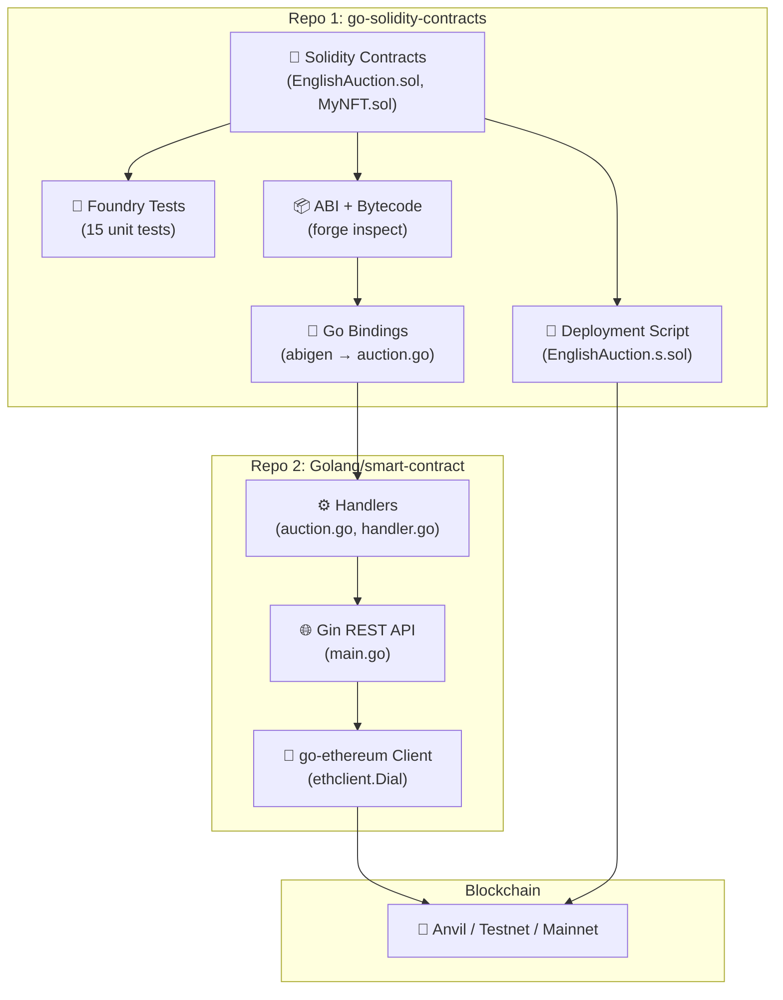
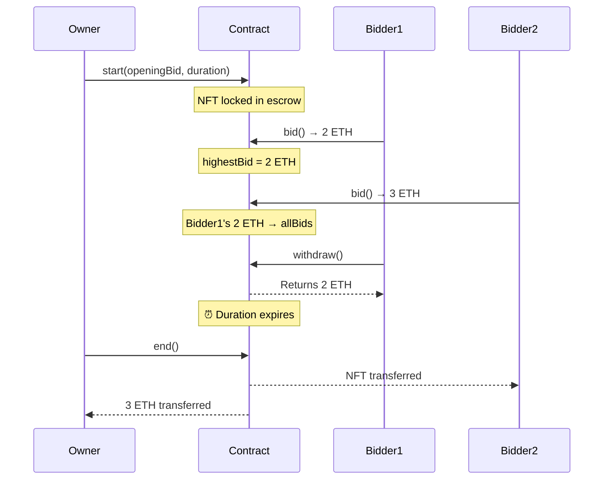
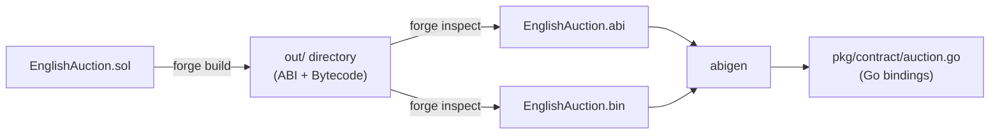
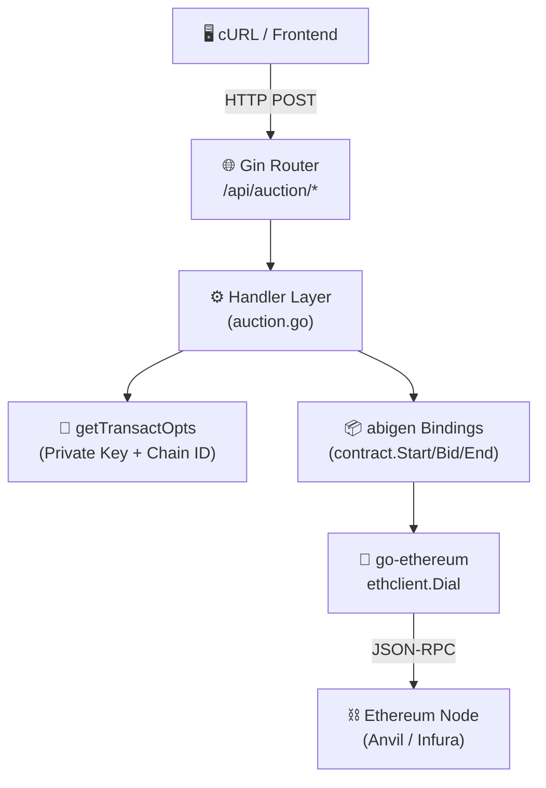
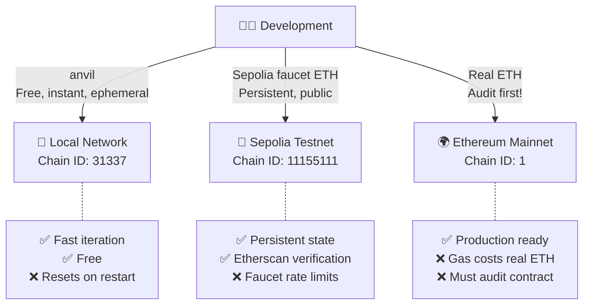

I recently finished the LinkedIn Learning course **"Build an Ethereum Smart Contract with Go and Solidity"**, and honestly, it turned into a much deeper rabbit hole than I expected. What started as "let me learn some Solidity basics" quickly turned into me building a full English Auction system with OpenZeppelin security, Foundry-based testing, auto-generated Go bindings, and a complete REST API to interact with it all.

This post is my attempt to document the entire journey — not just the *what*, but the *why* behind every architectural decision I made along the way.

---

## 🔗 Repositories

- **Smart Contracts (Solidity + Foundry)**: [Atharva0506/go-solidity-contracts](https://github.com/Atharva0506/go-solidity-contracts)
- **Go API Service**: [Atharva0506/Golang/smart-contract](https://github.com/Atharva0506/Golang/tree/main/smart-contract)

---

## 🏗️ The Big Picture

Before diving into code, let me explain how all the pieces fit together. This isn't just a Solidity contract sitting on a blockchain — it's a two-repo system where Solidity handles the on-chain logic and Go handles everything off-chain.



The flow is pretty linear: write Solidity → test it → compile it → generate Go code from the ABI → plug that Go code into a REST API → talk to the blockchain. Every step feeds into the next.

---

## 1. Writing the Smart Contract

### Why an English Auction?

I needed something more interesting than a basic token contract. An English Auction has real state management — it starts, people bid, someone wins, money moves around. It forces you to think about access control, reentrancy attacks, and edge cases like "what if nobody bids at all?"

### The Contract Structure

The `EnglishAuction.sol` contract handles the full auction lifecycle for a single NFT:

```solidity
// SPDX-License-Identifier: UNLICENSED
pragma solidity ^0.8.13;

import {IERC721} from "@openzeppelin/contracts/token/ERC721/IERC721.sol";
import {ReentrancyGuard} from "@openzeppelin/contracts/utils/ReentrancyGuard.sol";

contract EnglishAuction is ReentrancyGuard {
    // Immutables — set once, never changed
    address payable public immutable OWNER;
    IERC721 public immutable NFT;
    uint256 public immutable NFT_ID;

    // Auction state
    bool public started;
    bool public ended;
    uint256 public endTime;
    uint256 public highestBid;
    address public highestBidder;
    mapping(address => uint256) public allBids;

    // ... constructor, start(), bid(), withdraw(), end()
}
```

Four functions, that's it. But each one has subtle security considerations that took me longer to get right than I'd like to admit.

### The Auction Flow



### Security: The Stuff That Actually Matters

This is where the course really opened my eyes. Writing Solidity that *works* is easy. Writing Solidity that doesn't get exploited is a completely different game.

**ReentrancyGuard** — The `withdraw()` function sends ETH to external addresses. Without protection, a malicious contract could re-enter `withdraw()` before the balance is zeroed out and drain the entire contract. OpenZeppelin's `ReentrancyGuard` slaps a mutex on it.

**Checks-Effects-Interactions (CEI)** — This is a pattern I now follow religiously. Always:
1. **Check** requirements (`require(amount > 0)`)
2. **Effect** state changes (`allBids[msg.sender] = 0`)
3. **Interact** with external contracts (`payable(msg.sender).call{value: amount}("")`)

If you swap steps 2 and 3, you've got a reentrancy vulnerability. The contract zeros out the balance *before* sending the ETH — so even if someone tries to re-enter, there's nothing left to steal.

```solidity
function withdraw() external nonReentrant {
    uint256 amount = allBids[msg.sender];
    require(amount > 0, "Nothing to withdraw");

    // Effects — zero out BEFORE sending
    allBids[msg.sender] = 0;

    // Interactions — send funds
    (bool success,) = payable(msg.sender).call{value: amount}("");
    require(success, "Withdraw failed");
}
```

**Why `call{value:}` instead of `transfer()`?** — `transfer()` hardcodes a 2300 gas stipend which can cause failures with contracts that have receive functions doing any computation. `call{value:}` forwards all available gas and is the recommended pattern now.

---

## 2. Testing with Foundry

I picked Foundry over Hardhat for this project, and I'm glad I did. Writing tests in Solidity (instead of JavaScript) means you're testing in the same language as your contract — no context switching, no dealing with ethers.js type conversions.

### Test Setup

```solidity
function setUp() public {
    vm.startPrank(owner);

    nft = new MyNFT();
    nft.mint(owner, TOKEN_ID);

    auction = new EnglishAuction(address(nft), TOKEN_ID);
    nft.approve(address(auction), TOKEN_ID);

    vm.stopPrank();

    vm.deal(bidder1, 10 ether);
    vm.deal(bidder2, 10 ether);
}
```

Foundry's cheatcodes are incredibly powerful. `vm.prank()` lets you impersonate any address, `vm.deal()` gives addresses fake ETH, and `vm.warp()` lets you time-travel to test duration-based logic. Try doing that cleanly in JavaScript.

### The 15 Tests

I wrote tests covering every happy path and every revert case:

| Category | Tests |
| :--- | :--- |
| **Constructor** | Owner, NFT address, and token ID are set correctly |
| **Start** | Auction starts properly, reverts if not owner, reverts if already started |
| **Bid** | Valid bid works, reverts if not started, reverts if too low, reverts if owner bids, outbid refunds are tracked |
| **Withdraw** | Withdraw works, reverts if nothing to withdraw |
| **End** | Auction ends with winner, ends with no bids (NFT returns), reverts if too early, reverts if not owner |

Running them:

```bash
forge test -vvv
```

The `-vvv` flag gives you stack traces on failures, which is essential when debugging why a specific `require` statement fired.

---

## 3. Bridging Solidity → Go with abigen

This is the part that honestly blew my mind when I first learned about it. You can take a compiled Solidity contract and auto-generate a complete Go package that lets you deploy and interact with it — type-safe, no manual ABI encoding.

### How It Works



### Step by Step

**1. Extract the ABI and Bytecode:**

```bash
# ABI = the contract's API schema (what functions exist, their args/returns)
forge inspect EnglishAuction abi > out/EnglishAuction.abi

# Bytecode = compiled EVM code (needed for deployment)
forge inspect EnglishAuction bytecode > out/EnglishAuction.bin
```

Think of the ABI like a Swagger/OpenAPI spec, but for a smart contract. It tells any client exactly how to talk to the contract.

**2. Install abigen:**

```bash
go install github.com/ethereum/go-ethereum/cmd/abigen@latest
```

**3. Generate Go code:**

```bash
mkdir -p pkg/contract

abigen \
  --bin=out/EnglishAuction.bin \
  --abi=out/EnglishAuction.abi \
  --pkg=contract \
  --out=pkg/contract/auction.go
```

This creates a fully typed Go package with functions like `DeployEnglishAuction(...)`, `auction.Start(...)`, `auction.Bid(...)`, and `auction.End(...)`. No manual `abi.Pack()` calls, no hex string nonsense.

---

## 4. Building the Go REST API

With the generated bindings in hand, I built a Gin-based REST API that exposes the auction operations over HTTP. The idea is straightforward: HTTP request comes in → Go constructs a transaction → transaction gets sent to the blockchain.

### Architecture



### The Entry Point

The `main.go` connects to an Ethereum node, instantiates the contract wrapper, injects it into the handler, and starts the server:

```go
func main() {
    // Connect to Ethereum node
    client, err := ethclient.Dial(os.Getenv("ETH_NODE_URL"))
    if err != nil {
        log.Fatalf("Failed to connect: %v", err)
    }

    // Bind to the deployed contract
    contractAddress := common.HexToAddress(os.Getenv("CONTRACT_ADDRESS"))
    contractWrapper, _ := contract.NewContract(contractAddress, client)

    // Wire up the API
    h := handlers.NewHandler(contractWrapper)
    router := gin.Default()
    api := router.Group("/api/auction")
    {
        api.POST("/start", h.StartAuction)
        api.POST("/bid", h.CreateBid)
        api.POST("/end", h.EndAuction)
        api.POST("/withdraw", h.Withdraw)
    }
    router.Run(":8080")
}
```

### Transaction Authentication

Here's a piece I found really interesting — how Go signs Ethereum transactions. Every write operation on the blockchain needs a signature from a private key. The `getTransactOpts` helper handles this:

```go
func getTransactOpts(c *gin.Context) (*bind.TransactOpts, error) {
    privKeyHex := c.GetHeader("X-Private-Key")
    chainIDStr := c.GetHeader("X-Chain-ID")

    privateKey, _ := crypto.HexToECDSA(privKeyHex)
    chainID := big.NewInt(parsedChainID)

    auth, _ := bind.NewKeyedTransactorWithChainID(privateKey, chainID)
    return auth, nil
}
```

> **Important caveat**: Passing private keys in HTTP headers is fine for local development with throwaway Anvil keys, but you'd never do this in production. In a real app, users would sign transactions client-side using MetaMask or a similar wallet, and you'd submit the pre-signed transaction.

### The Bid Handler — Payable Functions in Go

The most interesting handler is `CreateBid`, because bidding is a *payable* function — it requires sending ETH along with the transaction:

```go
func (h *Handler) CreateBid(c *gin.Context) {
    var req models.BidRequest
    c.ShouldBindJSON(&req)

    auth, _ := getTransactOpts(c)

    // This is the key part — set the Value field to send ETH
    auth.Value = big.NewInt(req.Amount)

    tx, _ := h.Contract.Bid(auth)

    c.JSON(http.StatusOK, gin.H{
        "message": "Bid placed successfully",
        "txHash":  tx.Hash().Hex(),
    })
}
```

That `auth.Value` line is easy to miss but crucial. Without it, the transaction sends 0 ETH and the contract's `require(msg.value > highestBid)` will revert every time.

---

## 5. Local Development & Testing

### Running the Full Stack Locally

The local dev setup uses Foundry's **Anvil** — a blazing-fast local Ethereum node that gives you 10 pre-funded accounts out of the box.

**Terminal 1: Start the local blockchain**

```bash
anvil
```

This spins up a chain at `http://127.0.0.1:8545` with 10 test accounts, each loaded with 10,000 ETH. The private keys are deterministic and well-known — `0xac0974...` is always Account #0.

**Terminal 2: Deploy contracts**

```bash
forge script script/EnglishAuction.s.sol:EnglishAuctionScript \
  --rpc-url http://127.0.0.1:8545 \
  --private-key 0xac0974bec39a17e36ba4a6b4d238ff944bacb478cbed5efcae784d7bf4f2ff80 \
  --broadcast
```

**Terminal 3: Start the Go API**

```powershell
$env:CONTRACT_ADDRESS="0x9fE46736679d2D9a65F0992F2272dE9f3c7fa6e0"
$env:ETH_NODE_URL="http://127.0.0.1:8545"
go run main.go
```

### Testing with cURL

Once everything's running, you can test the full flow:

```bash
# 1. Start auction (as contract owner)
curl -X POST http://localhost:8080/api/auction/start \
  -H "X-Private-Key: ac0974bec39a17e36ba4a6b4d238ff944bacb478cbed5efcae784d7bf4f2ff80" \
  -H "X-Chain-ID: 31337" \
  -H "Content-Type: application/json" \
  -d '{"openingBid": 100, "duration": 3600}'

# 2. Place a bid (as a different account)
curl -X POST http://localhost:8080/api/auction/bid \
  -H "X-Private-Key: 59c6995e998f97a5a0044966f0945389dc9e86dae88c7a8412f4603b6b78690d" \
  -H "X-Chain-ID: 31337" \
  -H "Content-Type: application/json" \
  -d '{"amount": 200}'
```

### API Endpoints

| Method | Endpoint | Payload | Description |
| :--- | :--- | :--- | :--- |
| POST | `/api/auction/start` | `{"openingBid": 100, "duration": 3600}` | Starts the auction |
| POST | `/api/auction/bid` | `{"amount": 200}` | Places a bid (payable) |
| POST | `/api/auction/end` | `{}` | Ends the auction |
| POST | `/api/auction/withdraw` | `{}` | Withdraws outbid funds |

---

## 6. Deployment Strategies

### Local Network (Anvil)

This is what I covered above — great for development. Anvil is instant, free, and deterministic. The only downside is that state resets every time you restart it (though you can use `anvil --dump-state` to persist).

### Testnet (Sepolia)

When you're ready to test with a "real" blockchain that persists state, deploy to Sepolia:

```bash
forge script script/EnglishAuction.s.sol:EnglishAuctionScript \
  --rpc-url https://sepolia.infura.io/v3/YOUR_API_KEY \
  --private-key YOUR_TESTNET_PRIVATE_KEY \
  --broadcast \
  --verify
```

You'll need testnet ETH from a faucet (Google "Sepolia faucet"), and the `--verify` flag submits your source code to Etherscan so anyone can read the verified contract.

For the Go API, just swap the environment variables:

```bash
export ETH_NODE_URL="https://sepolia.infura.io/v3/YOUR_API_KEY"
export CONTRACT_ADDRESS="0x... (from deployment output)"
```

### Mainnet

Same commands, different RPC URL, real money:

```bash
forge script script/EnglishAuction.s.sol:EnglishAuctionScript \
  --rpc-url https://mainnet.infura.io/v3/YOUR_API_KEY \
  --private-key YOUR_MAINNET_PRIVATE_KEY \
  --broadcast \
  --verify
```



> **Word of caution**: Never deploy to mainnet without a professional security audit. My contract uses OpenZeppelin's battle-tested libraries, but custom logic can still have bugs. The blockchain is immutable — once deployed, you can't patch a vulnerability.

---

## 🧰 Useful Commands Cheat Sheet

```bash
# Foundry / Solidity
forge build               # Compile contracts
forge test -vvv            # Run tests (verbose)
forge fmt                  # Format Solidity code
forge snapshot             # Gas usage snapshot
forge inspect <C> abi      # View contract ABI
forge inspect <C> bytecode # View contract bytecode

# Local blockchain
anvil                      # Start local Ethereum node

# Go bindings
abigen --bin=X --abi=Y --pkg=Z --out=W  # Generate Go bindings

# Interact with deployed contract
cast call <addr> "highestBid()" --rpc-url <url>  # Read from contract
cast send <addr> "bid()" --value 1ether --rpc-url <url> --private-key <key>
```

---

## 🎯 Key Learnings

1. **Security is not optional in Solidity.** The CEI pattern and ReentrancyGuard aren't just "best practices" — they're the difference between a working contract and a drained one. Always think about who can call your functions and in what order.

2. **abigen is seriously underrated.** Most Ethereum tutorials focus on JavaScript/TypeScript with ethers.js. But if you're a Go developer, `abigen` gives you the same power with type safety and zero manual ABI encoding. It's one of the cleanest cross-language bridges I've seen.

3. **Foundry > Hardhat for testing (in my opinion).** Writing tests in Solidity eliminates an entire class of bugs that come from JavaScript-to-Solidity type mismatches. Plus, Foundry's cheatcodes (`vm.prank`, `vm.warp`, `vm.deal`) are incredibly expressive.

4. **Local-first development pays off.** Anvil's speed makes iteration cycles almost instant. I could modify a contract, recompile, redeploy, and test through the API in under 5 seconds. Compare that to waiting for a testnet confirmation.

5. **The deployment script is an underrated artifact.** Foundry's `forge script` system lets you write deployment logic in Solidity itself, which means your deployment is tested the same way your contract is. No more fragile deploy scripts in a different language.

---

## 🚀 What I'd Do Differently Next Time

- **Add event indexing**: Right now, there's no way to query historical bids without scanning all blocks. Adding an indexer (like The Graph) would make the API much more useful.
- **Frontend with MetaMask**: Replace the "private key in headers" approach with proper wallet-based signing. This is the standard for any user-facing dApp.
- **Multi-auction support**: The current contract only handles one NFT per deployment. A factory pattern would let a single contract manage multiple simultaneous auctions.
- **Gas optimization**: Run `forge snapshot` to identify expensive operations and explore packing state variables or using `uint128` where `uint256` is overkill.

---

## 🏁 Conclusion

Building this project gave me a much deeper understanding of how blockchain applications actually work end-to-end. It's not just about writing a Solidity contract — it's about the entire pipeline: testing, compiling, generating bindings, building APIs, and deploying across different networks.

If you're a Go developer curious about Web3, I'd honestly recommend starting with this exact stack (Solidity + Foundry + abigen + Gin). The tooling is mature, the feedback loop is fast, and you get to stay in a language you're comfortable with for the off-chain parts.

Feel free to explore the repos, break things, and reach out if you have questions!

---

## 🔗 References

- [Foundry Book](https://book.getfoundry.sh/) — Foundry documentation
- [OpenZeppelin Contracts](https://docs.openzeppelin.com/contracts/) — Security library
- [go-ethereum (Geth)](https://geth.ethereum.org/) — Go Ethereum client & abigen
- [Solidity by Example](https://solidity-by-example.org/) — Learn Solidity patterns
- [Build an Ethereum Smart Contract with Go and Solidity](https://www.linkedin.com/learning/build-an-ethereum-smart-contract-with-go-and-solidity) — LinkedIn Learning course
- [Smart Contracts Repo](https://github.com/Atharva0506/go-solidity-contracts) — Solidity contracts & Go bindings
- [Go API Repo](https://github.com/Atharva0506/Golang/tree/main/smart-contract) — REST API service
