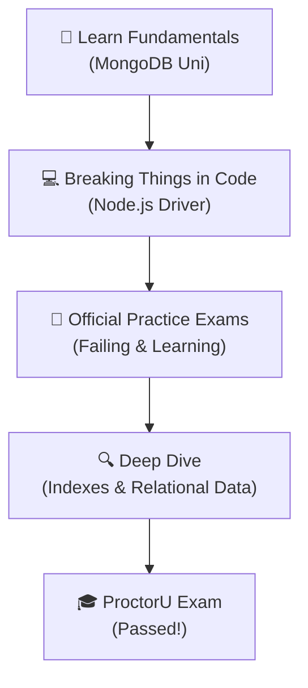
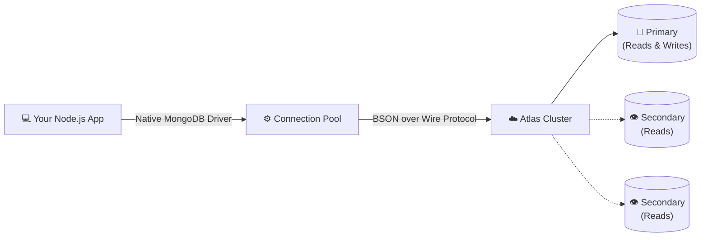

Let's be real—getting certifications can sometimes feel like just collecting badges. But a few months ago, I decided to go for the **MongoDB Associate Developer Node.js exam**. Why? Because I wanted to actually know what happens under the hood when I run a `.find()` or set up an index, instead of just hoping my Mongoose schemas don't break in production.

I wanted to share exactly what it takes to pass this thing without losing your mind. This isn't a fluff piece, just my raw notes, resources, and experience.

---

## 📝 About the Exam

This test isn't about memorizing useless trivia. It genuinely checks if you know how to build Node apps with MongoDB without doing things the "wrong" way.

- **Where**: ProctorU (Yeah, the strict remote-proctored setup)
- **What**: 53 Multiple Choice & Multiple Select questions
- **Time limits**: 75 minutes

---

## 📚 Resources I Used

Honestly, ignore the random third-party courses for this one. The official MongoDB stuff is actually really good (and completely free). Here’s what I stuck to:

1. **[MongoDB Node.js Developer Path](https://learn.mongodb.com/learning-paths/mongodb-nodejs-developer-path)** (This was my main study guide)
2. **[Official Practice Questions](https://learn.mongodb.com/learn/course/associate-developer-node-practice-questions/prep-questions/practice-questions?client=customer)** (Do NOT skip these!)
3. **[MongoDB Documentation](https://www.mongodb.com/docs/)**
4. **[Exam Registration Page](https://learn.mongodb.com/courses/mongodb-associate-developer-exam-nodejs)**
5. **[Official Program Guide](https://learn.mongodb.com/learn/course/program-guide/main/program-guide)**
6. **[Official Study Guide](https://learn.mongodb.com/learn/course/mongodb-associate-developer-exam-study-guide/main/associate-dba-exam-study-guide)**

---

## 🧠 My Preparation Strategy

I'm not great at just passively watching videos, so I built a messy repo to track all my code experiments. You can check it out here: **[Atharva0506/mongodb-nodejs-associate-prep](https://github.com/Atharva0506/mongodb-nodejs-associate-prep)**. 

Here is what my actual study progression looked like:

### 1. Stopping the Guesswork
I forced myself to actually learn the theory. When an aggregation pipeline broke, I stopped guessing and figured out exactly which stage was failing and why data was dropping out.

### 2. Writing Raw Code
Mongoose is great, but the exam specifically tests you on the native `mongodb` Node.js driver. I spent hours writing raw CRUD operations, messing around with cursors, and testing out edge cases just to see what kind of errors the driver would throw.

---

## 🔑 Important Topics to Focus On

If you're studying right now, don't waste time on niche features. Focus heavily on these core areas:

*   **CRUD Operations**: Know exactly what `.updateOne()` vs `.updateMany()` does, what arguments they take, and what shape the return object has.
*   **Data Modeling**: To embed or to reference? You need to know the basic rules of thumb for structuring your DB.
*   **Indexes**: This was huge. Learn Compound indexes and burn the **ESR (Equality, Sort, Range)** rule into your brain.
*   **The Node.js Driver**: Know how Promise-based cursors work natively.
*   **MongoDB Compass & Atlas**: Just have a good feel for what setting up a cluster looks like and how to use the Compass UI.

Here's the basic mental model of what the exam expects you to know about connecting Node to Mongo:

---

## 💡 Practice Questions Insight

Those official MongoDB University practice questions completely saved me. Some of them are insanely close to what you'll actually see on the real exam. 

They *will* try to trick you. Sometimes it's a misspelled method, sometimes it's a slightly malformed JSON structure. Take notes on why the wrong answers are wrong—it helps immensely.

---

## 🕒 My Experience During Exam

Taking tests on ProctorU is always a little stressful (clearing out the desk, showing the room to the camera, etc). You get about a minute and a half per question. 

Honest truth? Some of the Node syntax questions are so straightforward that I answered them in 10 seconds. That gave me so much extra time to stare at the complex Data Modeling questions and double-check my logic. You won't run out of time if you pace yourself, but you *must* read the provided code snippets very carefully.

---

## 🏆 Result & Certification

Got the passing score! It felt awesome to finally see the result page after weeks of studying.

- **Score Report**: [Here's my official Caveon report](https://sei.caveon.com/score/WyJmN2Y3NTk2ZC00ZTE0LTQzNjYtOTM1YS1mMmY5Yzg1NDc4NjgiLHRydWVd.If_F9OJu5D_6vcpEQmjSBgz3bfI)
- **Verified Credential**: [Credly Verification Badge](https://www.credly.com/badges/7c205345-273b-457d-b526-86d13fcf4aba/print)

---

## 🎯 Tips for Passing

If you're taking the exam soon, keep these in mind:

1.  **Type it out yourself**: Don't just read the docs. Type out pipelines in your editor so your fingers remember the syntax.
2.  **Watch out for `$lookup`**: Know what kind of array shape it outputs and how to handle it.
3.  **Use the Flag button**: If a question makes absolutely no sense, just flag it and move on. Staring at it for 5 minutes will just ruin your momentum.

---

## 🏁 Conclusion

Studying for this exam forced me to unlearn a lot of bad habits I'd picked up over the years. Even if your job doesn't specifically require the certification, going through this syllabus will just make your backend code way cleaner and more efficient.

If you're using Node.js and MongoDB, I say go for it. Good luck!
